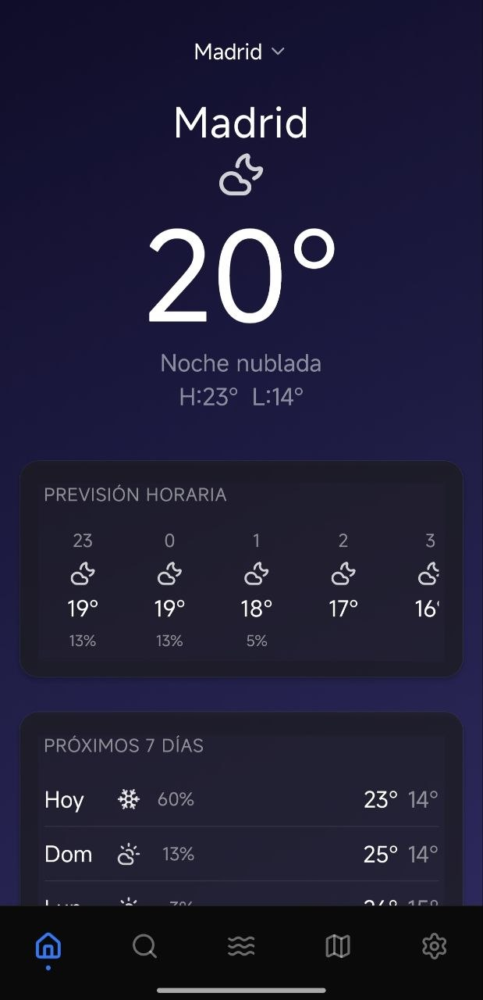
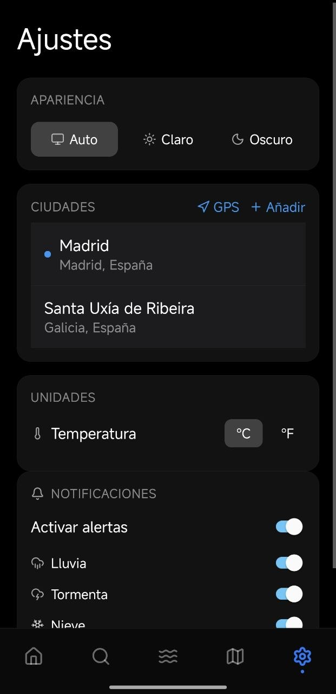
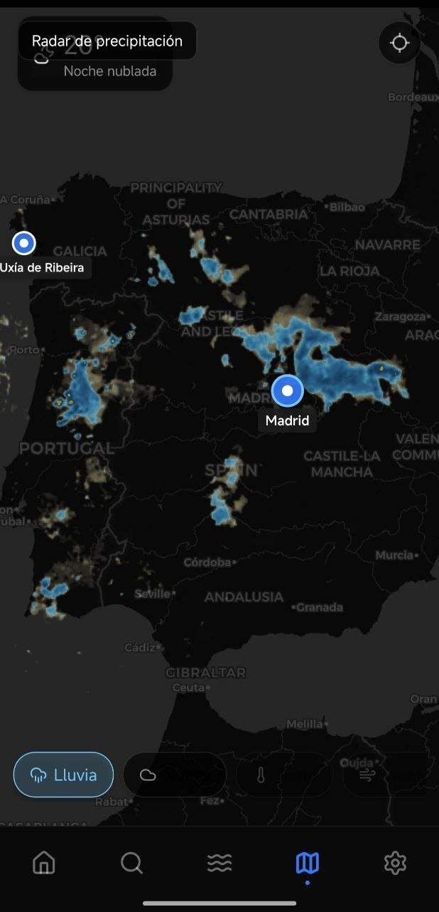
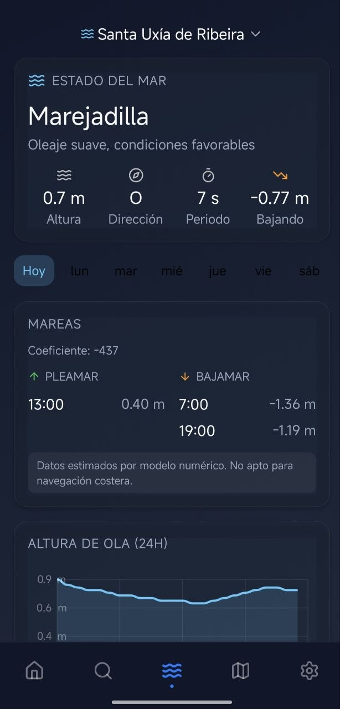
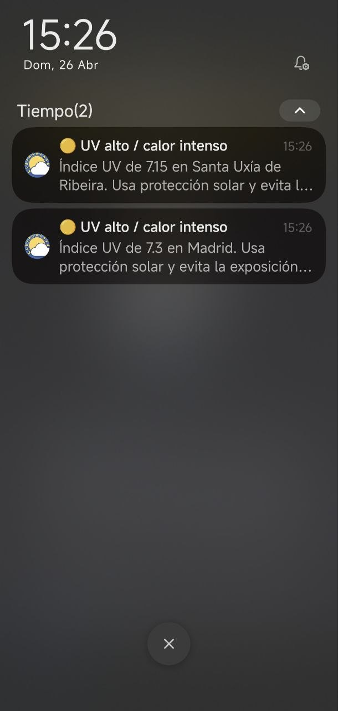

# Tiempo — Tu Clima en Tiempo Real - Version 2.4

[](https://expo.dev)
[](https://reactnative.dev)
[](https://www.typescriptlang.org)
[](https://www.nativewind.dev)
[](https://opensource.org/licenses/MIT)

**Tiempo** es una aplicacion meteorologica de alto rendimiento para Android, disenada para ofrecer datos precisos con una estetica minimalista inspirada en Apple Weather. Combina datos oficiales de la **AEMET** para Espana con la cobertura global de **Open-Meteo**.

---

## Vista Previa

<div align="center">
  
  
  
  
  
  
  </div>

---

## Caracteristicas Principales

- **Pronostico Detallado:** Tiempo actual, prevision por horas (24h) y a 7 dias.
- **Mareas Dinamicas:** Gráficos sinusoidales con **Skia** para zonas costeras. Deteccion automatica de ciudades costeras vs interiores con datos de la Open-Meteo Marine API. Indicador de marea subiendo/bajando en tiempo real y horarios de pleamar/bajamar.
- **Alertas Oficiales:** Integracion directa con avisos de la AEMET (lluvia, tormenta, nieve, viento, calor, frio, costera).
- **Mapa Interactivo:** Capas de radar de lluvia (RainViewer), satelite infrarrojo de nubes, y capas adicionales de temperatura, viento, humedad y presion via OpenWeatherMap. Modo oscuro con opacidad mejorada para mayor visibilidad.
- **Notificaciones Push:** Alertas meteorologicas en segundo plano con configuracion por tipo de alerta.
- **Interfaz Adaptativa:** Fondos degradados dinamicos que cambian segun la condicion climatica y el modo (claro/oscuro).
- **Gestion de Ciudades:** Busqueda con autocompletado y almacenamiento local ultra rapido con **MMKV**.
- **Geolocalizacion:** Acceso instantaneo al clima de tu ubicacion actual.
- **Claves API configurables:** El usuario puede introducir su propia API Key de OpenWeatherMap desde Ajustes para desbloquear capas adicionales del mapa.

---

## Stack Tecnologico

| Capa | Tecnologia |
|------|-----------|
| **Core** | [Expo SDK 54](https://expo.dev) + React Native |
| **Navegacion** | [Expo Router v4](https://docs.expo.dev/router/introduction/) (File-based) |
| **Estilos** | [NativeWind v4](https://www.nativewind.dev) (Tailwind CSS) |
| **Estado** | [Zustand](https://github.com/pmndrs/zustand) + [TanStack Query v5](https://tanstack.com/query/latest) |
| **Animaciones** | [Reanimated 3](https://docs.swmansion.com/react-native-reanimated/) + [Skia](https://shopify.github.io/react-native-skia/) |
| **Persistencia** | [MMKV](https://github.com/mrousavy/react-native-mmkv) |
| **Iconos** | [Lucide React Native](https://lucide.dev) |
| **Mapas** | [Leaflet](https://leafletjs.com/) via WebView + [RainViewer API](https://www.rainviewer.com/api.html) |

---

## Estructura del Proyecto

```text
tiempo-app/
├── app/                  # Rutas de Expo Router (Navegacion)
├── components/           # Componentes atomicos y modulares
│   ├── weather/          # └─ UI de clima (Hourly, Daily, Current)
│   ├── tides/            # └─ Graficos y tablas de mareas
│   ├── map/              # └─ Mapa interactivo (WeatherMap, LayerSelector)
│   ├── city/             # └─ Selector y gestion de ciudades
│   ├── alerts/           # └─ Banners de alertas AEMET
│   ├── theme/            # └─ Proveedores y UI adaptativa
│   └── ui/               # └─ Componentes base (Buttons, Skeletons, BottomNav)
├── hooks/                # Hooks personalizados (Queries, Location, WeatherLayers)
├── services/             # Clientes de API (AEMET, Open-Meteo, RainViewer, OpenWeatherMap)
├── stores/               # Estado global con Zustand + MMKV
├── utils/                # Utilidades (coastal detection, etc.)
└── types/                # Definiciones de TypeScript
```

---

## APIs Utilizadas

| API | Uso | Requiere Key |
|-----|-----|-------------|
| **AEMET API** | Datos oficiales para Espana, avisos meteorologicos | Si (`.env`) |
| **Open-Meteo** | Pronostico global, datos marinos (`/v1/marine` con mareas), fallback | No |
| **Open-Meteo Geocoding** | Motor de busqueda de localizaciones y ciudades | No |
| **RainViewer** | Tiles de radar de precipitacion y satelite infrarrojo | No |
| **OpenWeatherMap** | Tiles de temperatura, viento, humedad, presion | Si (Ajustes app) |

---

## Instalacion y Configuracion

Sigue estos pasos para levantar el entorno de desarrollo:

1. **Clonar el repositorio:**
```bash
git clone https://github.com/tu-usuario/tiempo.git
cd tiempo/tiempo-app
```

2. **Instalar dependencias:**
```bash
npm install
```

3. **Configurar variables de entorno:**
Crea un archivo `.env` en la raiz de `tiempo-app/`:
```env
EXPO_PUBLIC_AEMET_API_KEY=tu_api_key_aqui
```

4. **Ejecutar en Android:**
```bash
npm run android
```

### Configuracion de API Keys en la App

La app permite configurar claves API desde **Ajustes > Claves API** sin necesidad de recompilar:

- **OpenWeatherMap API Key:** Necesaria para desbloquear las capas adicionales del mapa (temperatura, viento, humedad, presion). Sin esta key, solo estaran disponibles las capas de lluvia y nubes (que usan RainViewer, gratuito y sin key).

Como obtener una API Key gratuita de OpenWeatherMap:
1. Registrate en [openweathermap.org](https://home.openweathermap.org/users/sign_up)
2. Ve a tu perfil > API Keys
3. Copia tu key y pegala en Ajustes > Claves API de la app

---

## Fases de Desarrollo

- [x] **Fase 0:** Scaffolding, TypeScript y NativeWind setup.
- [x] **Fase 1:** Core de prevision (Actual + 7 dias).
- [x] **Fase 2:** Gestion de ciudades y persistencia.
- [x] **Fase 3:** Integracion de Mareas con Skia y Open-Meteo Marine API.
- [x] **Fase 4:** Notificaciones Push y Alertas AEMET.
- [x] **Fase 5:** Mapas meteorologicos interactivos (RainViewer + OpenWeatherMap tiles).
- [x] **Fase 6:** Capas adicionales del mapa (temperatura, viento, humedad, presion) con API Key configurable.
- [x] **Fase 7:** Mareas v2 — Indicador de marea subiendo/bajando, horarios de pleamar/bajamar via sea_level_height_msl.
- [ ] **Fase 8:** Animacion de radar en tiempo real (timeline de frames RainViewer).
- [ ] **Fase 9:** Widgets de pantalla de inicio.

---

## Licencia

Este proyecto esta bajo la Licencia MIT. Consulta el archivo [LICENSE](../LICENSE) para mas detalles.

---

Desarrollado con ❤️ por Hugo Perez-Vigo
